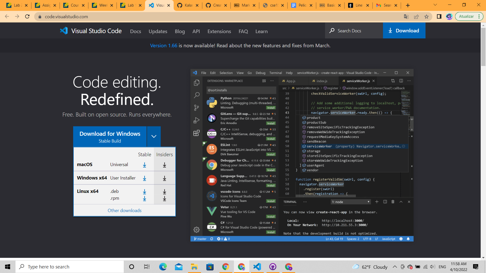

# Lab report week 2 
**April 10, 2022**

This is the first entry of my lab reports, in which I will go over how to log into a course-specific account on ieng6. Below are the summarized steps that will be covered in this report:

* Installing VScode
* Remotely connecting
* Experimenting with commands
* Moving files with scp
* Setting an SSH Key
* Optimizing remote running

## Installing VScode
VScode is a popular code editor which we'll be using for this course and can be installed [here](https://code.visualstudio.com/). Upon clicking the link, the user should see a blue download button and install the version compatible with their device.

