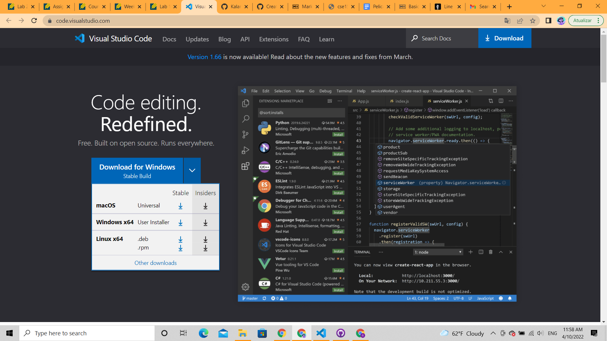
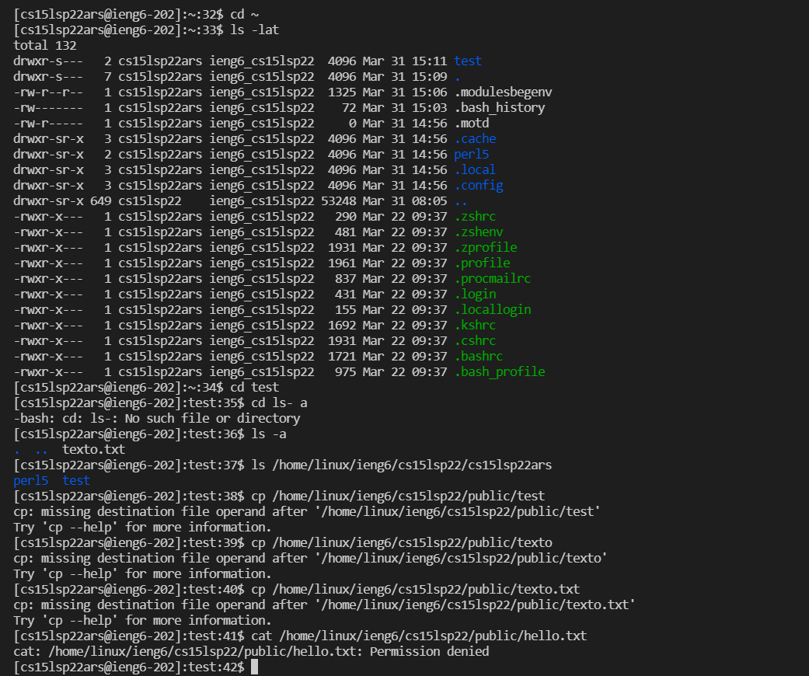
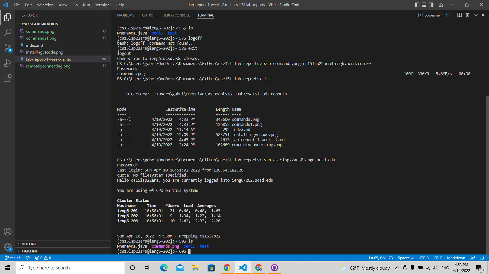
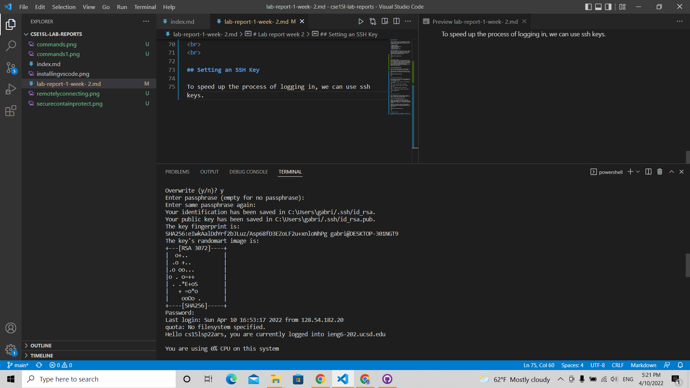
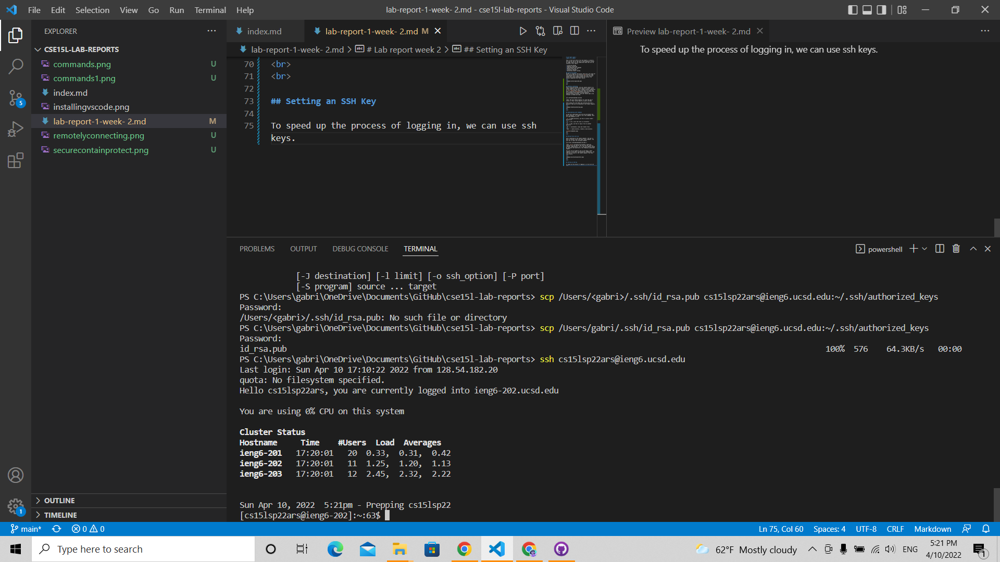
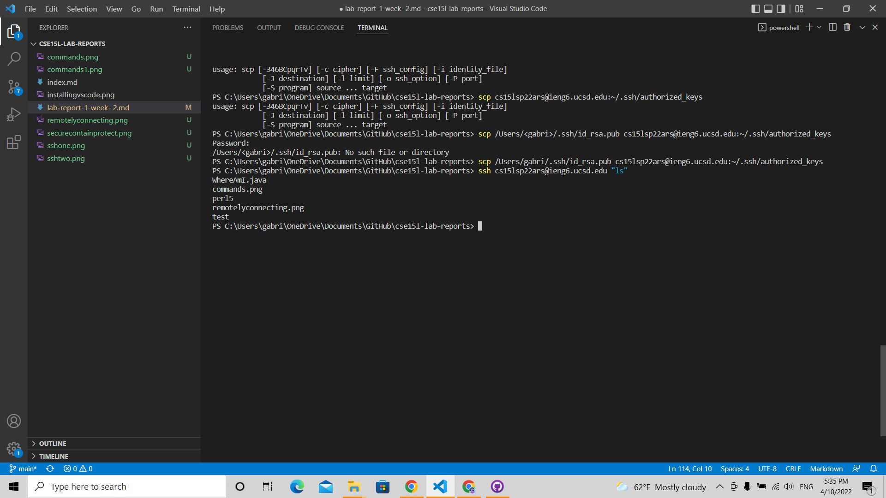

# Lab Report Week 2 
**April 10, 2022**

This is the first entry of my lab reports, in which I will go over how to log into a course-specific account on ieng6. Below are the summarized steps that will be covered in this report:

* Installing VScode
* Remotely connecting
* Experimenting with commands
* Moving files with scp
* Setting an SSH Key
* Optimizing remote running

## Installing VScode
VScode is a popular code editor which we'll be using for this course and can be installed [here](https://code.visualstudio.com/). Upon clicking the link, the user should see a blue download button and install the version compatible with their device.
<br>
<br>

<br>
***

## Remotely connecting
After installing VScode, the user should connect to a remote computer with a course specific account, which can be found with the user's student account credentials in [this page](https://sdacs.ucsd.edu/~icc/index.php). After installing [OpenSSH](https://docs.microsoft.com/en-us/windows-server/administration/openssh/openssh_install_firstuse), the user should open a new terminal in VSCode and type:

```
ssh cs15lsp22zz@ieng6.ucsd.edu
```
>Note: The user should replace "zz" with the last 3 letters of their course-specific account username.

After typing the line above and inserting the user's password, they will be connected to the remote computer.
<br>
<br>

***
<br>

## Experimenting with commands

To get more comfortable with the new environment and Unix in general, it's good to run a few commands. Here are some examples to try:

`cd` -> change directory, use this to access folder/ directories
<br>
`ls` -> list, lists the files in a directory
<br>
`cp` -> copy, use this to copy a file to another directory
<br>
`cat` -> concatenate, views and creates files
<br>
`mkdir` -> make directory, creates a new directory


***
<br>

## Moving files with scp

After connecting to the remote computer, the user is able to transfer files from their local computer. The user has to input the following command:
```
scp [file] cs15lsp22zz@ieng6.ucsd.edu:~/
```
>Note: [file] (including the brackets) should be replaced with the name of the file the user wants to transfer. Additionally, "zz" in the user address should be replaced like specified in the "Remotely connecting" segment.

The user will be asked to log in once again. After logging in with their course-specific credentials, the file will be saved in the remote computer from their local device.
<br>
<br>

***
<br>

## Setting an SSH Key

To speed up the process of logging in, we can use ssh keys. First, the user should type the following command in their local machine:
```
ssh-keygen
```
When asked if they would like to add a paraphrase, the user should not enter anything for now.
<br>

<br>
<br>
Then, the user should create a repository in the remote computer to transfer the key to with:
```
ssh cs15lsp22zz@ieng6.ucsd.edu
mkdir .ssh
```
Finally, the user should transfer their key to the remote repository from the local machine. The user should logout with
```
logout
```
And then (in the local computer):
```
scp /Users/<user-name>/.ssh/id_rsa.pub cs15lsp22zz@ieng6.ucsd.edu:~/.ssh/authorized_keys
```
After these steps, the user will be able to log in and access the remote computer without having to type their password everytime.
<br>


<br>
***

## Optimizing remote running
We can make access of the remote computer and even command lines faster with a couple of shortcuts. For instance, the user can use commands in the remote computer from the local computer by using quotes:

```
ssh cs15lsp22zz@ieng6.ucsd.edu "ls"
```
>Note: the command is being prompted from the local machine. Additionally, "ls" can be replaced with any Unix command.

<br>



Using the up arrow will also input the last used command in the prompt. The user can use up arrow to access previous command lines without having to retype everything.
***
<br>
<br>
