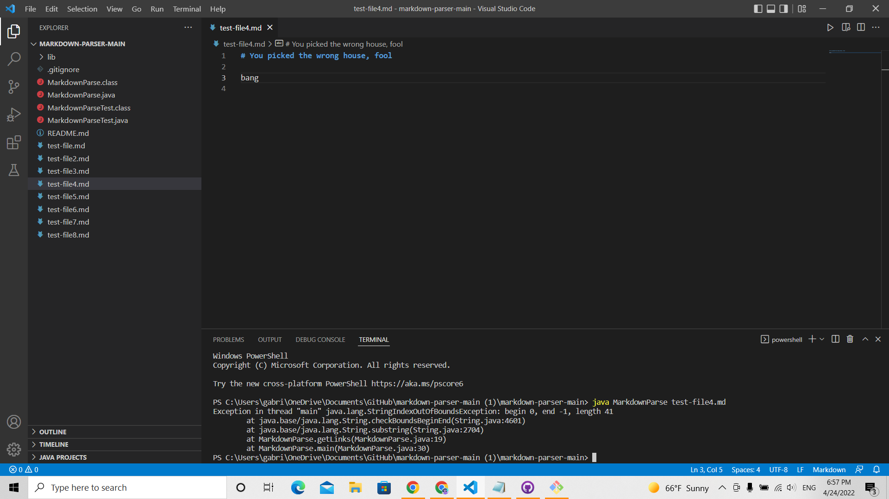
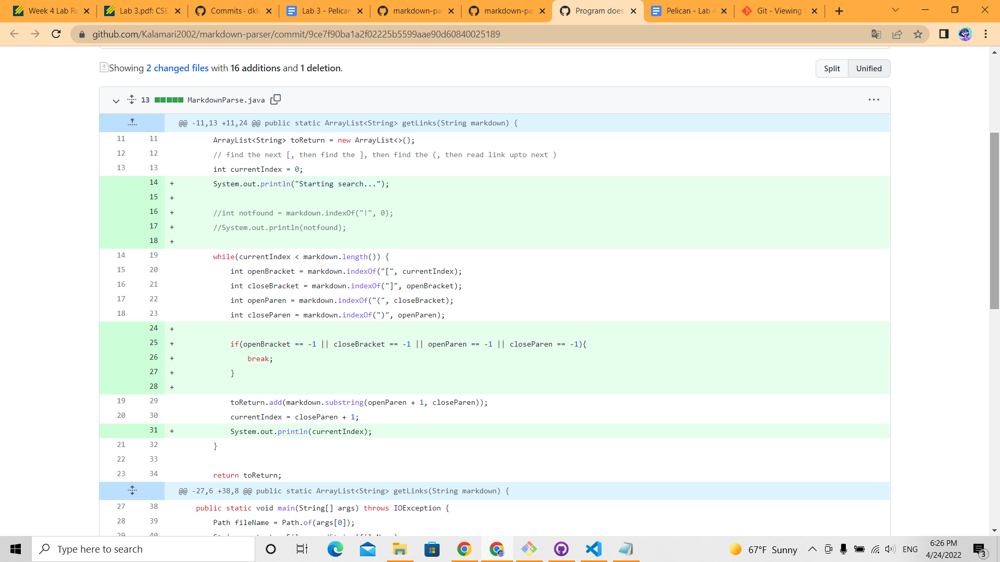
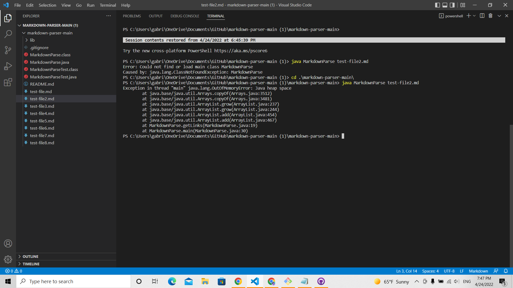
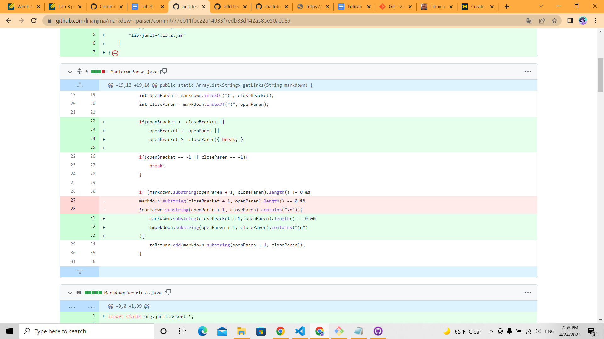
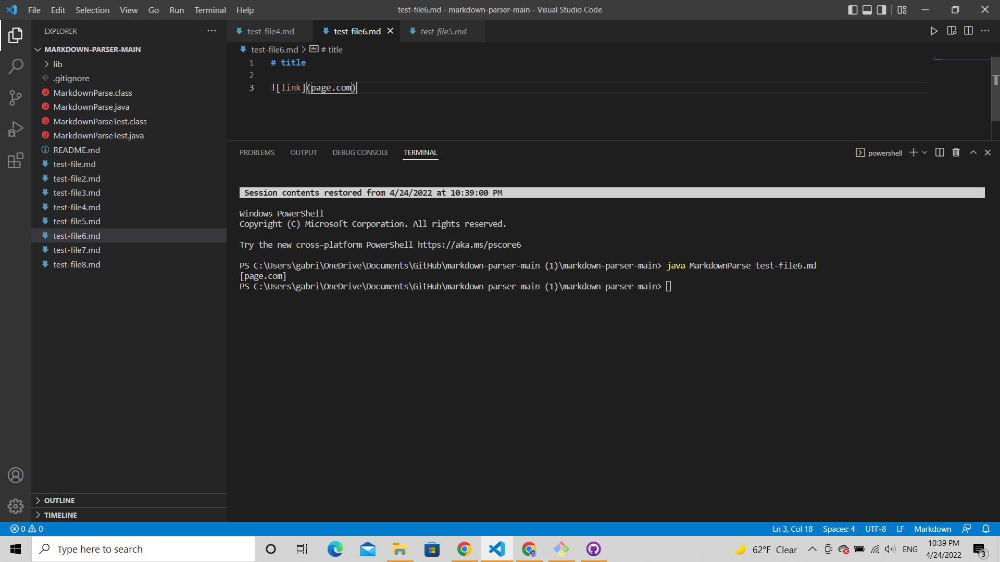
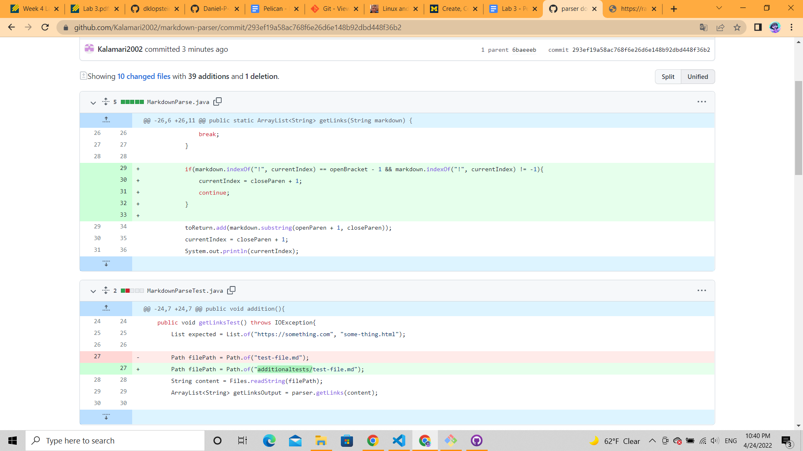

# Lab Report Week 4
**April 24, 2022**

For the past two weeks, we focused on the process of debugging and testing. We worked on a markdown parser and tested files that worked and files that caused the parser to throw an exception.

A particular error would occur when the parser was used on the [new-test-file.md](https://github.com/Kalamari2002/markdown-parser/blob/cd66830f7f6894be8e8ebd3c264cd079248e7aa5/new-test-file.md) file. The output of the file read:
 
 

 
 
This symptom prompted me to make the following changes to the code:
 
 

 
 
I realized that the first version of the parser did not have a way of handling files that contained no brackets. This bug caused the program to attempt to access negative indices, since markdown.indexOf returns -1 by default if the specified character is not found. Because of that, the program would throw an IndexOutOfBoundsException instead of returning no links.

Another symptom I ran into while testing the first version of the code on the [last-test-file.md](https://github.com/Kalamari2002/markdown-parser/blob/main/last-test-file.md) file was an infinite loop.
 
 

 
 
[Lilian Ma](https://github.com/lilianjma/markdown-parser/commit/77eb11fbe22a14033f7edb83d142a585e50a0089), along with several other groupmates, encountered the same error while testing the parser. This prompted the following change to the code:
 
 

 
 
It's noticeable that this solution is similar to the one I implemented on my fork to solve the first mentioned symptom. This is because, as we discussed in class, it's possible for one bug to present multiple symptoms, and this is one of such cases. The code does not have a proper way of dealing with iterations/files in which no brackets are found, thus, if a file ends with text (instead of a link), the loop never ends.
 
 
The last symptom I found was during the testing of the [test-file6.md](https://github.com/Kalamari2002/markdown-parser/blob/main/additionaltests/test-file6.md) file, which revealed that the parser included images as links.
 
 

 
 
To fix this issue, I added the following lines to the parser:
 
 

 
 
The previous version of the parser didn't consider "!" in its search and displayed image links as a symptom. Since the syntax for images in markdown differs from that of links only by the "!" character, the parser would consider images as links. To fix this bug, I specified that the parser should simply skip the following link if it detects a "!" followed by a "[" character.
