# Lab Report Week 6
**May 8, 2022**


During the last two weeks, we learned a couple of ways to optimize access to the remote computer and work on github repositories using our course specific accounts. One trick we learned to make the log in process faster was to streamline the ssh config file, this way, we could use a short key word, such as ieng6, instead of the entire email address when using ssh.
<br>
<br>
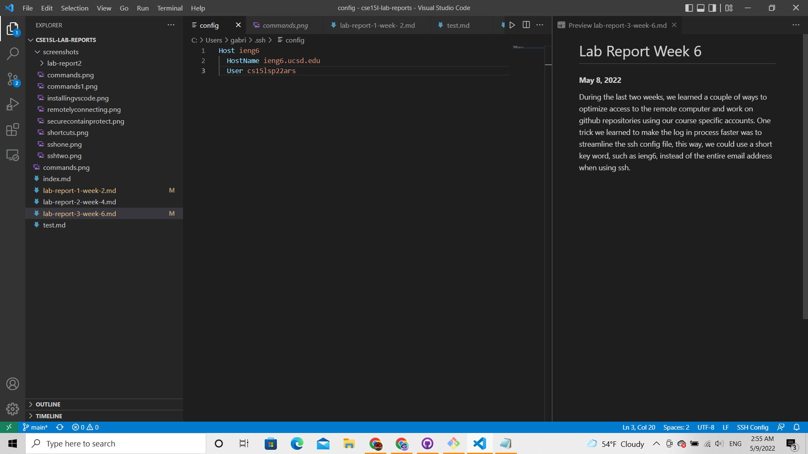
<br>
<br>
By specifying the keyword "ieng6" instead of my entire account address under the Host field, I can simply type `ssh ieng6` to login into the remote computer.
<br>
<br>
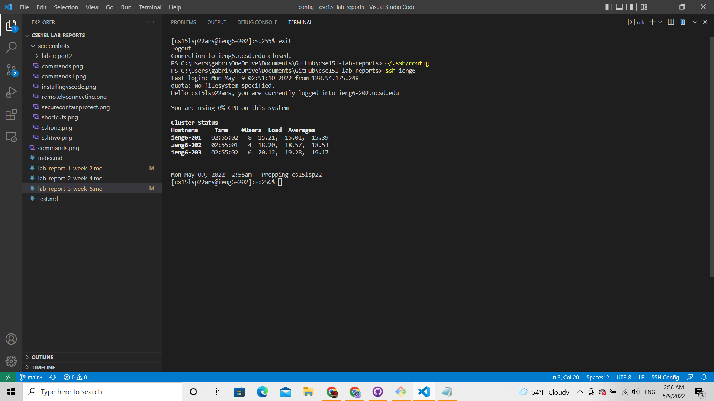
<br>
<br>
This also means that transfering files with `scp` is much easier, because we can also use the same keyword to replace the address. In the example below, I copy a file named "monke.txt" into the remote computer using the "ieng6" word:
<br>
<br>
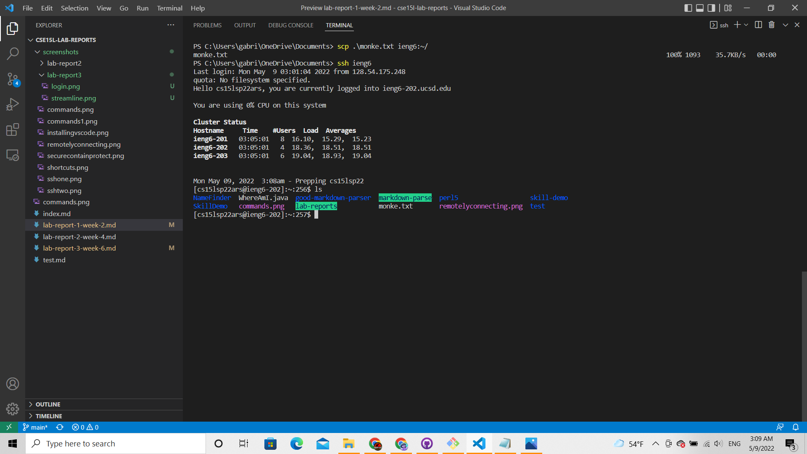
<br>
<br>
We also went over how to use ssh keys in the remote computer. We begin by creating a keygen like normally, however, we can do this in the remote computer using the `ssh-keygen` command. A key pair should be stored in the remote computer after inputting the command. In this example, both private and public keys are stored in the same directory:
<br>
<br>
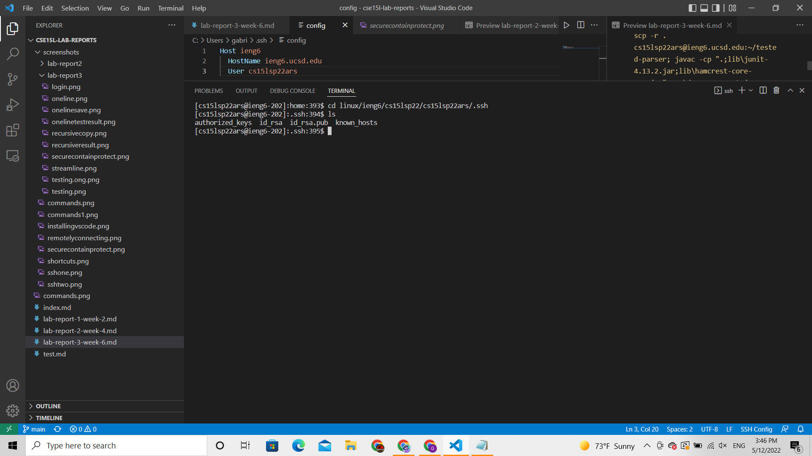
<br>
<br>
Then, the user should include the public key content in their account. This can be done by clicking their profile > settings > SSH and GPG keys > New SSH key. After pasting the public key's content onto the "key" box and giving the key a title, the user may store it on Github:
<br>
<br>
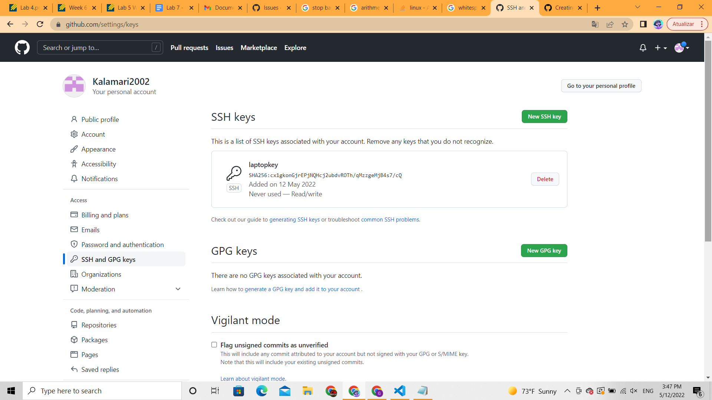
<br>
<br>
Finally, the user should be able to commit and push from the remote computer to any repository.
<br>
<br>
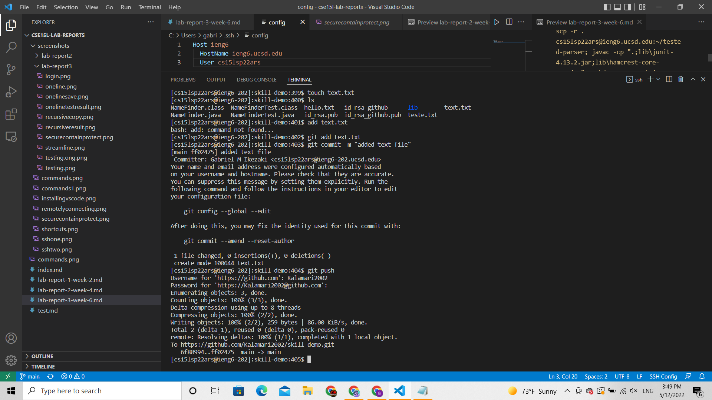
<br>
<br>
This is the [link](https://github.com/Kalamari2002/skill-demo/commit/ff024753693b461e3a1093e0332c22f20dcc8b0c) to the commit shown in the example above, where I added the "text.txt" file to my repository.


Another useful command we learned is `scp -r`, which allows the user to recursively copy a directory from the local to the remote computer. In the example below, I copied the markdown parser directory from my laptop to the remote computer:
<br>
<br>
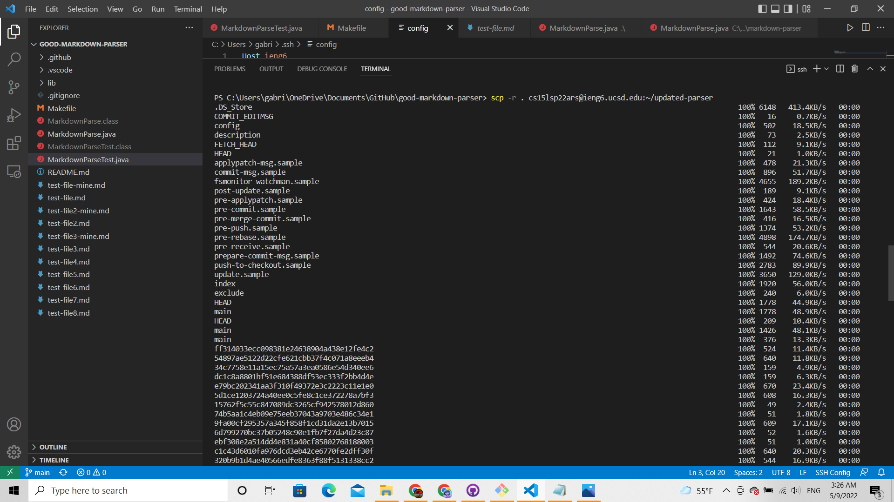
<br>
<br>
As expected, the repository was successfully copied to the remote computer:
<br>
<br>
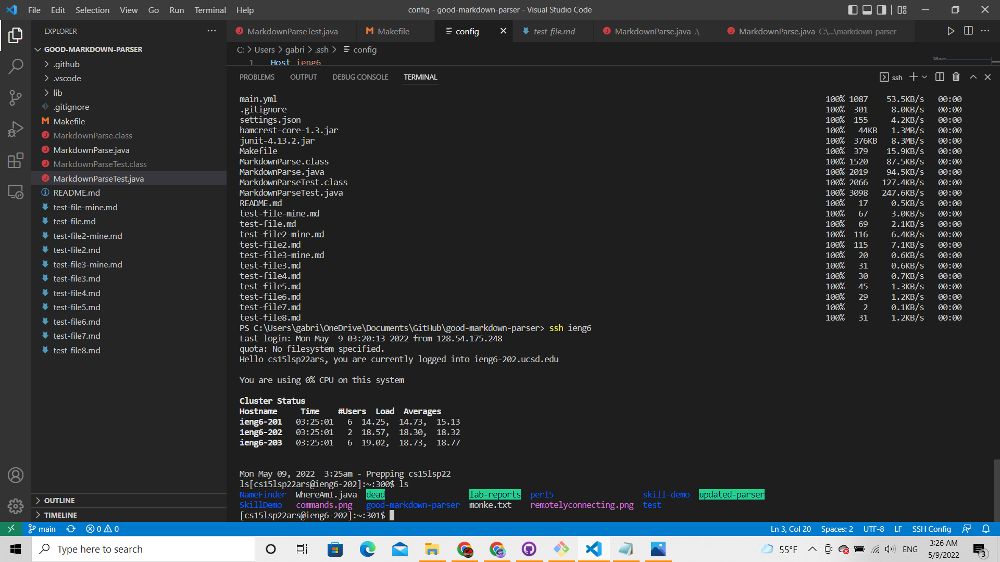
<br>
<br>
If the user decides to run the repository tests within the remote computer, they should find that the tests run as expected, too. 
<br>
<br>
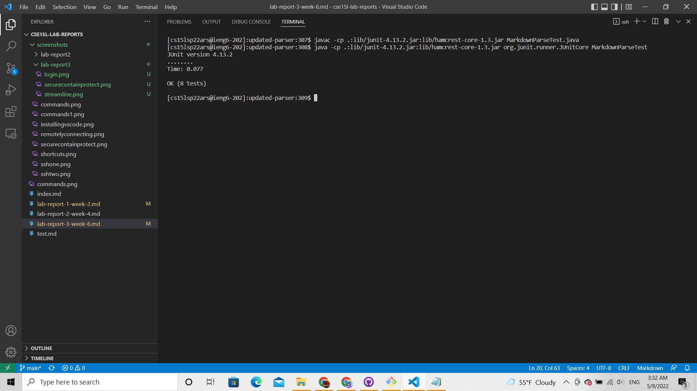
<br>
<br>
The user can choose to be even more efficient and copy, compile AND test a directory all in one line. The user may do this by chaining commands with `;` and type something like<br> 
```scp -r . cs15lsp22ars@ieng6.ucsd.edu:~/tested-parser; javac -cp ".;lib\junit-4.13.2.jar;lib\hamcrest-core-1.3.jar" MarkdownParseTest.java MarkdownParse.java; java -cp ".;lib/junit-4.13.2.jar;lib/hamcrest-core-1.3.jar" org.junit.runner.JUnitCore MarkdownParseTest```:
<br>
<br>
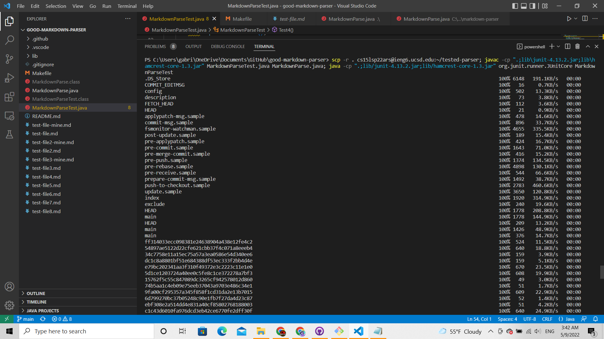
<br>
<br>
Naturally, the tests will run right after the directory is copied:
<br>
<br>
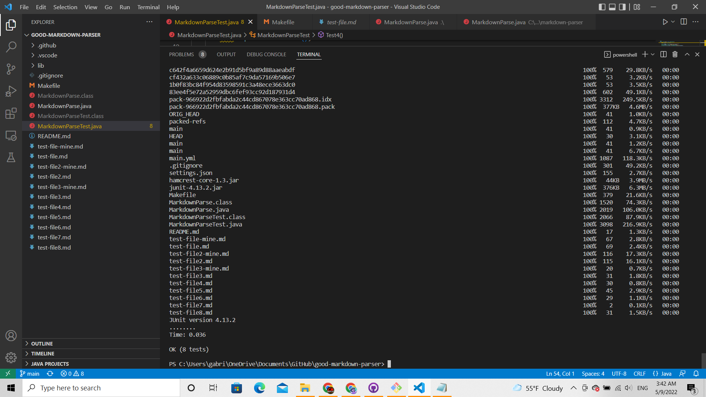
<br>
<br>
And the user should see the copied repository in the remote computer:
<br>
<br>
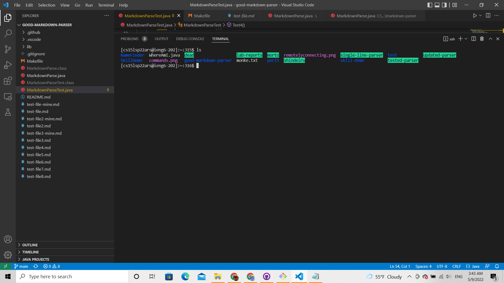