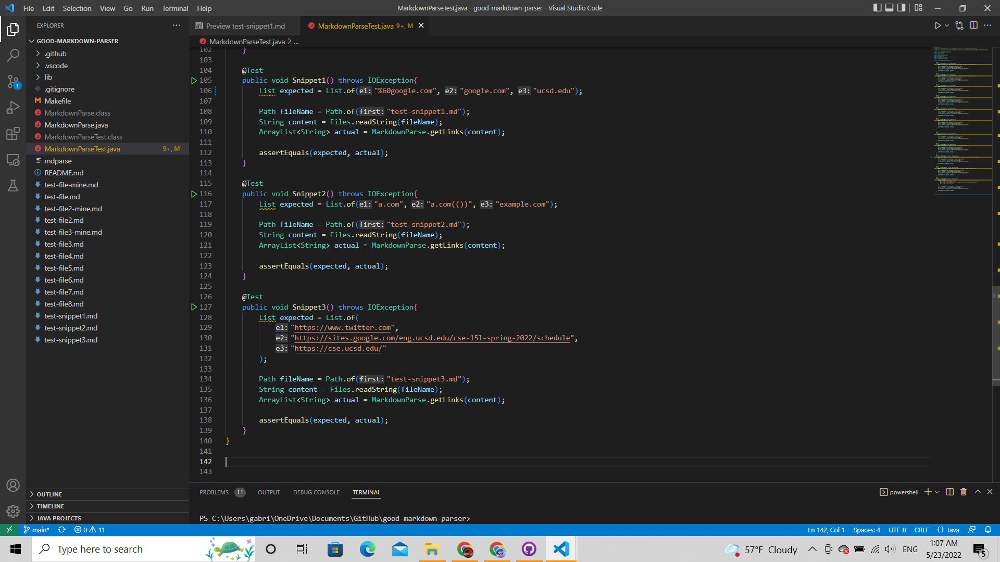
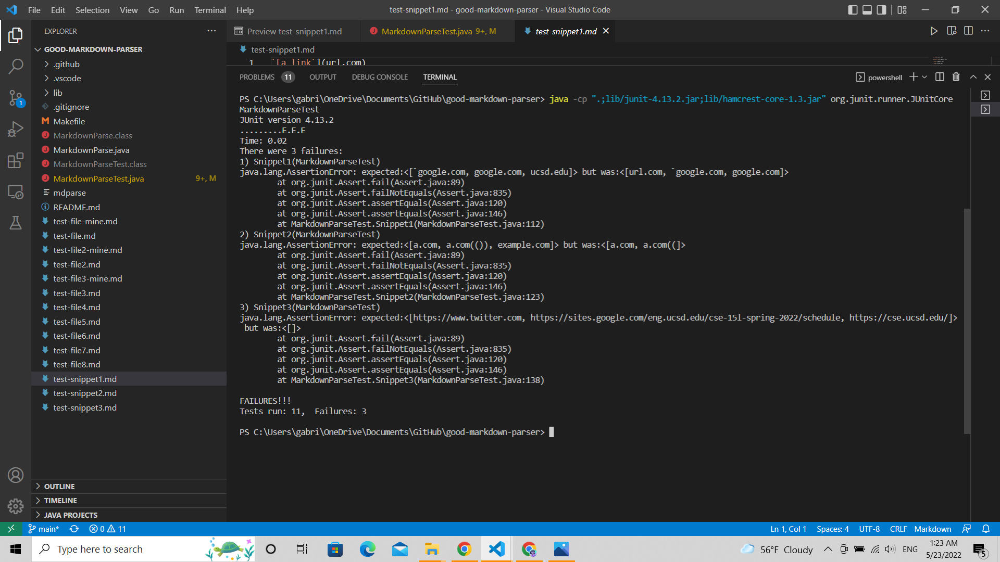
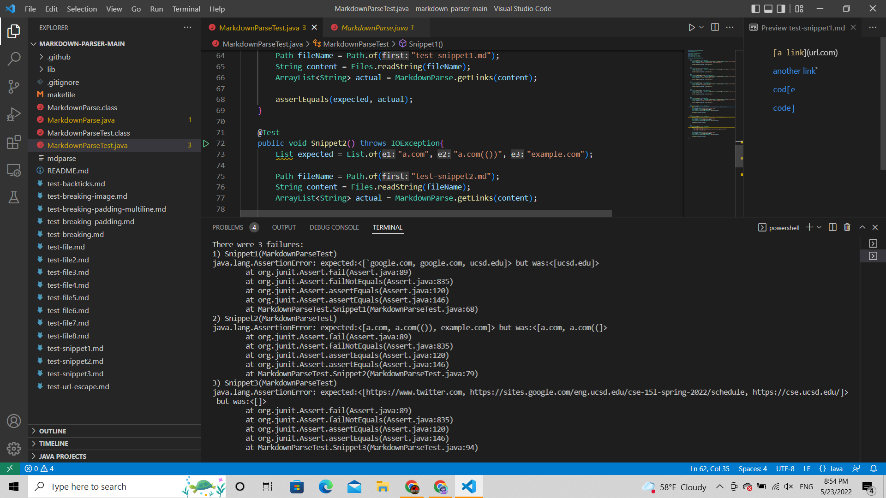

# Lab Report Week 8
**May 22, 2022**

Last week, we exchanged [our](https://github.com/ryankosta/good-markdown-parser) version of the markdown parser with another group of students and reviewed [their](https://github.com/UDXS/markdown-parser) code, checking for any possible edge cases that could cause a symptom. For this lab report, we were given additional markdown snippets to test both versions with:

Snippet 1 
```
`[a link`](url.com)

[another link](`google.com)`

[`cod[e`](google.com)

[`code]`](ucsd.edu)
```

Snippet 2
```
[a [nested link](a.com)](b.com)

[a nested parenthesized url](a.com(()))

[some escaped \[ brackets \]](example.com)
```

Snippet 3
```
[this title text is really long and takes up more than 
one line

and has some line breaks](
    https://www.twitter.com
)

[this title text is really long and takes up more than 
one line](
https://sites.google.com/eng.ucsd.edu/cse-15l-spring-2022/schedule
)


[this link doesn't have a closing parenthesis](github.com

And there's still some more text after that.

[this link doesn't have a closing parenthesis for a while](https://cse.ucsd.edu/


)

And then there's more text

```
 The given link formatting was intentionally very confusing, which is why my reference for what should be considered a link is the VScode preview display. The following is how I decided to test each snippets in the test files of both parser versions:
<br>
<br>

<br>
<br>
As it turns out, my version of the parser did not succeed in either of the tests:
<br>
<br>

<br>
<br>
As of now, my version of the code doesn't consider the
```
`
``` 
character, meaning that even links formated like 
```
`[a link`](url.com) 
```
will be read as a regular link, since the only considered characters are [] and (). Additionally, whenever a bracket or parenthesis is opened, the code will only consider the next closing character and nothing else following it, meaning that
```
[`code]`](ucsd.edu)
```
is not considered a link since
```
[`code]
```
is not followed by parentheses. This same flaw may also explain why
```
[a nested parenthesized url](a.com(()))

[some escaped \[ brackets \]](example.com)
```
are incomplete, with "a.com(())" being read as "a.com((" and "example.com" not being read at all. Finally, my version of the code does not seem to handle any type of white space well, as none of the links included in snippet 3 were read by my parser. There's a part of my code that is causing any content in parentheses to be skipped with the inclusion of white spaces.

The result produced by our peer's code was not too different from my version:
<br>
<br>

<br>
<br>
The only snippet whose results differed was snippet 1, in which the only detected link was
```
ucsd.edu
```

I think that I could make my version work for snippet 1 by specifying that brackets enclosed by backticks should not be counted as formatted links. This is a relatively small change which should not take more than 10 lines of code to implement.

As for the second snippet, I don't think I would be able to create a solution within 10 lines. My version of the code does not address nested links to any degree and I get the impression that I would need to specify these edge cases, as small changes to already existing code would likely not be enough to fix them. More specifically, I would need to find a way to count only the inner links in a nested link and allow my code to include closing parantheses.

Finally, the third snippet, I imagine, could be fixed with a relatively smaller change. I would need to remove the specification that disables the parser to count content followed by "\n" as links. However, I need to be careful not to create other edge case vulnerabilities in trying to fix this one.

