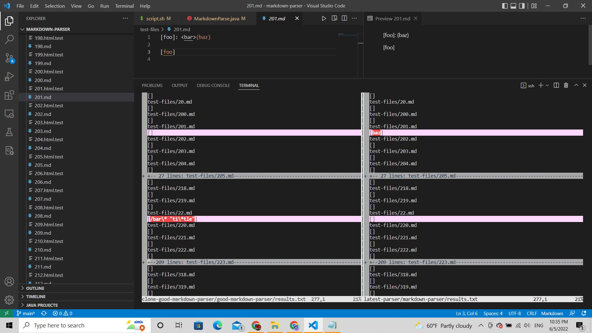

# Lab Report Week 10
**June 5, 2022**

This marks the final entry of this journal. Last week, we learned how to run the parser on multiple files automatically. Another tool we learned about was vimdiff, which allows users to compare results of mulitple md files when run by different versions of the parser. Using vimdiff, I could find multiple test cases that produced different results for different versions of the parser, despite running the same md file. Below, I will highlight two examples that were particularly interesting to me: [22.md](https://github.com/nidhidhamnani/markdown-parser/blob/main/test-files/22.md) and [201.md](https://github.com/nidhidhamnani/markdown-parser/blob/main/test-files/201.md) (outputs highlighted in pink).
 
 

 
 
For 22.md, neither my nor the provided versions of the parser had the correct output. Assuming that the VSCode preview shows the correct output for links, the expected result was [ti*tle], while my version read [/bar\ * "ti\ *tle"] and the provided version did not read any links. What surprised me however, was that my version read the correct output for 201.md while the provided version did not. No links should have been detected for 201.md, which corresponds to the results of my version. The provided version, however, read [baz] as a link.

My version of the code is reading the wrong link for 22.md. Instead of reading [ti*tle], my version is reading the entire content encapsulated by paranthesis, being [/bar\ * "ti\ *tle"]. This also includes "\ *" which is read as \* in markdown. 

For 201.md, the provided version is not breaking the link with text in between the brackets and paranthesis. So instead of returning an empty list, this version still reads [baz] as a link despite being separated by the initial brackets.